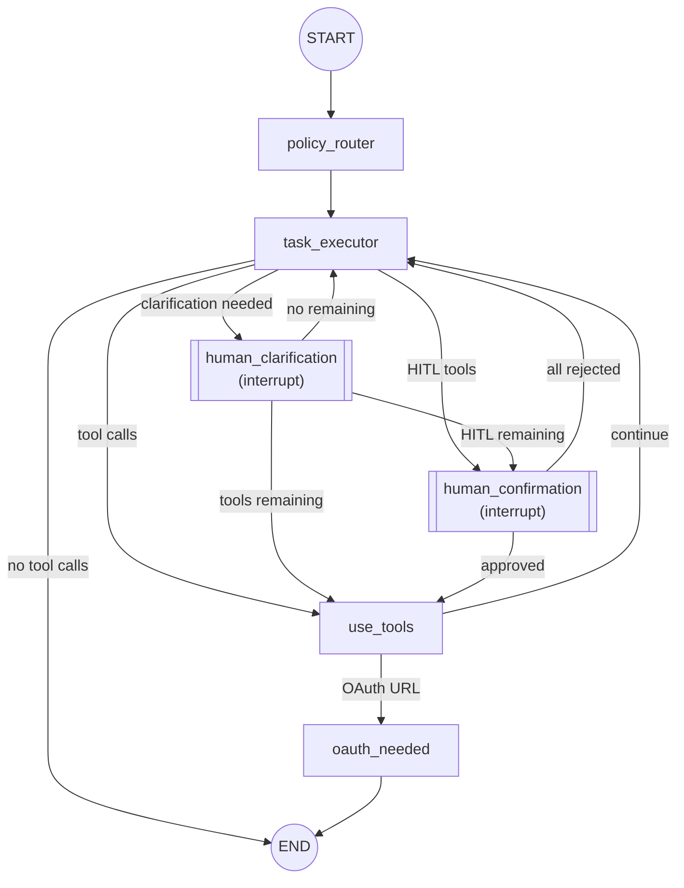

# MSG-Agent

A LangGraph-based agentic system that acts as an MCP client, consuming tools from assistant-mcp to fulfill user requests for calendar operations.

## Architecture



### Nodes

| Node | Purpose |
|------|---------|
| `policy_router` | Evaluates user request and determines which tool types (calendar, maps) are allowed |
| `task_executor` | Main agent loop - makes tool calls, requests clarifications, produces final response |
| `use_tools` | Executes MCP tool calls via LangGraph ToolNode |
| `human_clarification` | Human-in-the-loop node for clarification requests when info is ambiguous |
| `human_confirmation` | Human-in-the-loop node for tools requiring user approval (handles mixed HITL/non-HITL tool calls) |
| `oauth_needed` | Handles OAuth URL responses by setting final_response |

### Conditional Edges

| Edge | From | Routes To | Condition |
|------|------|-----------|-----------|
| `route_from_task_executor` | task_executor | human_clarification | If clarification tools detected (priority) |
| `route_from_task_executor` | task_executor | human_confirmation | If HITL tools detected |
| `route_from_task_executor` | task_executor | use_tools | If tool_calls present |
| `route_from_task_executor` | task_executor | END | If no tool_calls |
| `oauth_url_detection` | use_tools | oauth_needed | If OAuth URL detected |
| `oauth_url_detection` | use_tools | task_executor | Otherwise (continue loop) |
| `route_from_human_clarification` | human_clarification | human_confirmation | If HITL tools remain |
| `route_from_human_clarification` | human_clarification | use_tools | If non-HITL tools remain |
| `route_from_human_clarification` | human_clarification | task_executor | If no tools remain |
| `route_from_human_confirmation` | human_confirmation | use_tools | If any tools approved |
| `route_from_human_confirmation` | human_confirmation | task_executor | If all rejected |

## Project Structure

```
msg-agent/
├── .env                       # Environment configuration (API keys, Langfuse)
├── .gitignore
├── .python-version            # Python 3.13
├── pyproject.toml             # Dependencies and metadata
├── uv.lock                    # Dependency lock file
├── README.md
│
├── tests/
│   ├── conftest.py                 # Pytest fixtures, mock tools and mappings
│   ├── client.py                   # Interactive REPL test client
│   ├── benchmark/                  # Speed benchmark tests
│   │   ├── test_policy_router_speed.py
│   │   └── test_task_executor_speed.py
│   └── unit/                       # Unit tests
│       ├── test_human_confirmation.py
│       ├── test_human_clarification.py
│       ├── test_policy_router.py   # Mock + real LLM tests for policy_router
│       └── test_task_executor.py   # Mock LLM tests for task_executor routing
│
└── src/
    ├── main.py                # FastAPI entry point
    │
    ├── agentic/
    │   ├── config.py          # Model initialization, Langfuse callback
    │   ├── state.py           # RequestState schema
    │   ├── graph.py           # LangGraph workflow definition (run_graph, resume_graph)
    │   ├── edges.py           # Conditional routing logic
    │   │
    │   ├── nodes/
    │   │   ├── agent.py       # policy_router, task_executor
    │   │   ├── tool.py        # use_tools node (MCP tool execution)
    │   │   └── human.py       # human_confirmation, human_clarification, oauth_needed
    │   │
    │   └── schema/
    │       ├── prompts.py     # Agent system prompts
    │       ├── models.py      # Pydantic models for structured outputs
    │       └── tools.py       # LangChain tools (request_clarification)
    │
    ├── mcp_module/
    │   └── adapter.py         # MCP client setup, TOOL_MAPPING
    │
    └── utils/
        ├── helpers.py         # Utility functions
        └── models.py          # FastAPI request/response models
```

## Installation

```bash
# Clone the repository
git clone <repo-url>
cd msg-agent

# Install dependencies with uv
uv sync
```

## Configuration

Create a `.env` file with:

```env
ASSISTANT_MCP_URL=http://127.0.0.1:8000/mcp
GOOGLE_API_KEY=your-google-api-key
OPENAI_API_KEY=your-openai-api-key
LANGFUSE_PUBLIC_KEY=your-langfuse-public-key
LANGFUSE_SECRET_KEY=your-langfuse-secret-key
LANGFUSE_HOST=https://cloud.langfuse.com
```

| Variable | Description |
|----------|-------------|
| `ASSISTANT_MCP_URL` | URL to the assistant-mcp server (or any mcp server) |
| `GOOGLE_API_KEY` | API key for Gemini models (optional) |
| `OPENAI_API_KEY` | API key for OpenAI models (optional) |
| `LANGFUSE_PUBLIC_KEY` | Langfuse public key for observability (optional) |
| `LANGFUSE_SECRET_KEY` | Langfuse secret key for observability (optional) |
| `LANGFUSE_HOST` | Langfuse host URL (optional) |

## Running

```bash
uv run uvicorn src.main:app --port 8002
```

The server runs on `http://127.0.0.1:8002`.

## API

### POST /run

Execute a user request through the agent workflow.

**Request:**
```bash
curl -X POST http://127.0.0.1:8002/run \
  -H "Content-Type: application/json" \
  -d '{"thread_id": "any-string", "user_request": "show me what is on my calendar"}'
```

**Request Body:**

| Field | Type | Description |
|-------|------|-------------|
| `thread_id` | string | Identifier for the conversation thread |
| `user_request` | string | Natural language request |

**Response (success):**
```json
{
  "status": "success",
  "response": "Upcoming event on your primary calendar:\n\n- Test Event\n  - When: Friday, January 15, 2026 from 1:30 PM to 2:30 PM"
}
```

**Response (clarification required):**
```json
{
  "status": "clarification_required",
  "thread_id": "any-string",
  "pending_action": {
    "kind": "clarification",
    "clarifications": [
      {
        "call_id": "call_abc123",
        "question": "What would you like to schedule?",
        "context": "Scheduling on the primary calendar."
      }
    ]
  }
}
```

**Response (HITL confirmation required):**
```json
{
  "status": "confirmation_required",
  "thread_id": "any-string",
  "pending_action": {
    "kind": "confirmation",
    "tool_calls": [
      {
        "call_id": "call_abc123",
        "tool_name": "create_event",
        "arguments": {
          "calendar_id": "primary",
          "start": "2026-01-16T10:00:00",
          "name": "Team Meeting",
          "duration_minutes": 30
        }
      }
    ]
  }
}
```

### POST /resume

Resume a paused graph execution after human clarification or confirmation.

**Request (for clarification):**
```bash
curl -X POST http://127.0.0.1:8002/resume \
  -H "Content-Type: application/json" \
  -d '{
    "thread_id": "any-string",
    "clarification_responses": [
      {"call_id": "call_abc123", "response": "a meeting tomorrow at 3pm"}
    ]
  }'
```

**Request (for confirmation):**
```bash
curl -X POST http://127.0.0.1:8002/resume \
  -H "Content-Type: application/json" \
  -d '{
    "thread_id": "any-string",
    "approvals": [
      {"call_id": "call_abc123", "approved": true}
    ]
  }'
```

**Request Body:**

| Field | Type | Description |
|-------|------|-------------|
| `thread_id` | string | Same thread_id from the /run response |
| `clarification_responses` | array? | List of responses to clarification questions |
| `clarification_responses[].call_id` | string | The call_id from pending_action.clarifications |
| `clarification_responses[].response` | string | User's response to the clarification question |
| `approvals` | array? | List of approval decisions for tool calls |
| `approvals[].call_id` | string | The call_id from pending_action.tool_calls |
| `approvals[].approved` | boolean | Whether to approve this tool call |
| `approvals[].feedback` | string? | Optional feedback (required if rejected) |

*Note: Provide either `clarification_responses` or `approvals`, not both.*

**Response:**
```json
{
  "status": "success",
  "response": "Team Meeting has been created for January 16, 2026 at 10:00 AM."
}
```

### GET /health-check

Health check endpoint.

```bash
curl http://127.0.0.1:8002/health-check
```

## MCP Tool Mapping

Modify this to whatever MCP server you are connecting.

```python
TOOL_MAPPING = {
    'calendar': ["list_calendars", "list_events", "create_event", "update_event"]
}

# Tools requiring human-in-the-loop confirmation
HITL_TOOLS = {'create_event', 'update_event'}
```

## State Schema

```python
class RequestState(MessagesState):
    allowed_tool_types: list[str]              # From policy_router
    pending_action: NotRequired[PendingAction] # OAuth, clarification, or confirmation
    final_response: NotRequired[str]           # Final message to user
    approval_outcome: NotRequired[ApprovalOutcome]  # Result of HITL approval
    auth_url: NotRequired[str]                 # OAuth URL (cleared on new requests)

class ToolCallInfo(TypedDict):
    call_id: str              # Unique ID from AIMessage.tool_calls[].id
    tool_name: str
    arguments: dict[str, Any]

class ClarificationInfo(TypedDict):
    call_id: str
    question: str
    context: NotRequired[str]

class RejectedToolFeedback(TypedDict):
    call_id: str
    tool_name: str
    feedback: str

class ApprovalOutcome(TypedDict):
    all_approved: bool
    approved_call_ids: List[str]
    rejected_feedback: List[RejectedToolFeedback]

class PendingApproval(TypedDict):
    kind: Literal["confirmation"]
    tool_calls: List[ToolCallInfo]

class PendingClarification(TypedDict):
    kind: Literal["clarification"]
    clarifications: List[ClarificationInfo]
```

### pending_action.kind Values
- `"clarification"` - Agent needs user clarification
- `"confirmation"` - Human-in-the-loop confirmation for HITL tools
- `"oauth_url"` - OAuth URL elicitation flow
- `"form_elicitation"` - Form-based elicitation flow
- `"no_action_needed"` - Default

## Human Clarification Flow

When the agent needs more information from the user (e.g., ambiguous request like "schedule something"), it uses the `request_clarification` tool.

### Flow Diagram

```
1. /run request with ambiguous info
   ↓
2. task_executor calls request_clarification tool
   ↓
3. Sets pending_action.kind = "clarification"
   ↓
4. Routes to human_clarification node
   ↓
5. interrupt() pauses graph, returns 202 to client
   ↓
6. Client displays clarification questions
   ↓
7. /resume with clarification_responses
   ↓
8. human_clarification processes responses:
   - If HITL tools remain → human_confirmation
   - If non-HITL tools remain → use_tools
   - If no tools remain → task_executor
```

### Clarification with Mixed Tools

When the agent calls both `request_clarification` and other tools (HITL or non-HITL) in the same message:

1. Clarification is processed **first** (priority over HITL)
2. Other tools are deferred with dummy ToolMessages
3. After clarification, a new AIMessage is created with remaining tools
4. If remaining tools include HITL → routes to human_confirmation
5. If remaining tools are non-HITL only → routes to use_tools

### Example: Complex Flow

```
User: "schedule something for me, and move the meeting at 3pm to 4pm"
    ↓
Agent calls: [request_clarification, update_event]
    ↓
clarification_required (priority)
    Question: "What would you like to schedule?"
    ↓
User provides: "a dentist appointment on Friday at 10am"
    ↓
confirmation_required (deferred update_event)
    Tool: update_event (move meeting to 4pm)
    ↓
User: approved
    ↓
confirmation_required (new create_event from clarification)
    Tool: create_event (Dentist Appointment)
    ↓
User: approved
    ↓
success: Both actions completed
```

## Human-in-the-Loop (HITL) Flow

Tools in `HITL_TOOLS` (`create_event`, `update_event`) require user confirmation before execution.

### Flow Diagram

```
1. /run request
   ↓
2. task_executor detects HITL tools
   ↓
3. Sets pending_action.kind = "confirmation" with tool_calls
   ↓
4. Routes to human_confirmation node
   ↓
5. interrupt() pauses graph, returns 202 to client
   ↓
6. Client displays tool calls for user approval
   ↓
7. /resume with approvals
   ↓
8. human_confirmation processes approvals:
   - All approved → use_tools → execute → task_executor → END
   - All rejected → task_executor (with feedback) → may retry
   - Partial → use_tools (approved only) → task_executor (feedback) → END
```

### Approval Scenarios

| Scenario | Behavior |
|----------|----------|
| **All HITL approved** | All tools execute (HITL + non-HITL), returns success response |
| **All HITL rejected (no non-HITL)** | Feedback sent to task_executor, agent may propose alternatives |
| **All HITL rejected (with non-HITL)** | Non-HITL tools execute, feedback sent to agent |
| **Partial HITL approval** | Approved HITL + all non-HITL tools execute, rejected feedback sent to agent |

### Mixed Tool Handling

When an AIMessage contains both HITL tools (e.g., `create_event`) and non-HITL tools (e.g., `list_calendars`):
- Non-HITL tools are **auto-approved** and always included in execution
- Only HITL tools require user confirmation
- If all HITL tools are rejected, non-HITL tools still execute via a new AIMessage

### Message Sequence (Partial Approval with Mixed Tools)

When some tools are approved and others rejected, the message sequence must satisfy the API requirement that every `tool_call` has a corresponding `ToolMessage`:

```
1. AIMessage with tool_calls [HITL_A, HITL_B, non_HITL_C]
2. ToolMessage for HITL_A (approved placeholder)
3. ToolMessage for HITL_B (rejected with feedback)
4. ToolMessage for non_HITL_C (auto-approved placeholder)
5. New AIMessage with tool_calls [HITL_A, non_HITL_C]
6. ToolMessage for HITL_A (actual execution result)
7. ToolMessage for non_HITL_C (actual execution result)
```

## Testing

Run all tests in parallel:

```bash
uv run pytest tests/ -n auto -v
```

- `-n auto` uses all available CPU cores (always use this flag)
- `-n 4` uses 4 workers (specify manually)

### Test Architecture

Tests are fully decoupled from src definitions via mock constants and fixtures in `conftest.py`:

**Mock Tool Mapping:**
```python
MOCK_TOOL_MAPPING = {
    'calendar': ['mock_list_calendars', 'mock_list_events', 'mock_create_event', 'mock_update_event'],
    'maps': ['mock_search_places', 'mock_get_directions'],
}

MOCK_HITL_TOOLS = {'mock_create_event', 'mock_update_event'}
```

**Sample Tool Call Constants (for unit tests):**
```python
SAMPLE_CLARIFICATION_CALL = {'id': 'call_clarify_1', 'name': 'request_clarification', ...}
SAMPLE_HITL_CALL = {'id': 'call_create_1', 'name': 'mock_create_event', ...}
SAMPLE_NON_HITL_CALL = {'id': 'call_list_1', 'name': 'mock_list_events', ...}
```

**Mock Tools:**
| Tool | Type | Description |
|------|------|-------------|
| `mock_list_calendars` | calendar | Returns mock calendar list |
| `mock_list_events` | calendar | Returns mock events |
| `mock_create_event` | calendar, HITL | Returns created event |
| `mock_update_event` | calendar, HITL | Returns updated event |
| `mock_search_places` | maps | Returns mock places |
| `mock_get_directions` | maps | Returns mock directions |

**Fixtures:**
| Fixture | Scope | Purpose |
|---------|-------|---------|
| `patch_hitl_tools` | autouse | Patches `HITL_TOOLS` in human and agent modules |
| `patch_tool_mapping` | autouse | Patches `TOOL_MAPPING` in agent.py and prompts.py |
| `mock_mcp_client` | manual | Patches `CLIENT.get_tools` to return mock tools |
| `timing_threshold` | manual | Returns speed thresholds for benchmark tests |
| `verify_api_key` | manual | Skips test if no API key available |

This ensures tests don't break when `TOOL_MAPPING` or `HITL_TOOLS` in `mcp_module/adapter.py` changes.

### Unit Tests

**test_policy_router.py** - Tests for `policy_router` node:
- `TestPolicyRouterMockLLM`: Mock LLM tests (post-LLM extraction logic)
- `TestPolicyRouterRealLLM`: Real LLM tests (requires API key via `verify_api_key` fixture)

**test_task_executor.py** - Tests for `task_executor` node routing logic:
- `TestClarificationRouting`: Clarification tool detection and priority
- `TestHITLRouting`: HITL tool detection and extraction
- `TestNoToolCalls`: Final response handling when no tools are called
- `TestRegularToolCalls`: Non-HITL tool handling (no pending_action)

## Testing Flows

Start the server:
```bash
uv run uvicorn src.main:app --port 8002
```

### Test 1: Clarification Flow

```bash
# Step 1: Ambiguous request
curl -X POST http://127.0.0.1:8002/run \
  -H "Content-Type: application/json" \
  -d '{"thread_id": "test-clarify", "user_request": "schedule something"}'

# Response: clarification_required with call_id and question

# Step 2: Provide clarification
curl -X POST http://127.0.0.1:8002/resume \
  -H "Content-Type: application/json" \
  -d '{"thread_id": "test-clarify", "clarification_responses": [{"call_id": "<call_id>", "response": "a meeting tomorrow at 3pm"}]}'

# Response: confirmation_required for create_event

# Step 3: Approve
curl -X POST http://127.0.0.1:8002/resume \
  -H "Content-Type: application/json" \
  -d '{"thread_id": "test-clarify", "approvals": [{"call_id": "<call_id>", "approved": true}]}'

# Response: success with event created
```

### Test 2: Direct Approval

```bash
# Step 1: Create event request
curl -X POST http://127.0.0.1:8002/run \
  -H "Content-Type: application/json" \
  -d '{"thread_id": "test-1", "user_request": "create a meeting called Standup tomorrow at 9am"}'

# Response: confirmation_required with call_id

# Step 2: Approve
curl -X POST http://127.0.0.1:8002/resume \
  -H "Content-Type: application/json" \
  -d '{"thread_id": "test-1", "approvals": [{"call_id": "<call_id>", "approved": true}]}'

# Response: success with event created
```

### Test 2: Rejection with Feedback

```bash
# Step 1: Create event request
curl -X POST http://127.0.0.1:8002/run \
  -H "Content-Type: application/json" \
  -d '{"thread_id": "test-2", "user_request": "create an event called Dentist tomorrow at 9am"}'

# Step 2: Reject with feedback
curl -X POST http://127.0.0.1:8002/resume \
  -H "Content-Type: application/json" \
  -d '{"thread_id": "test-2", "approvals": [{"call_id": "<call_id>", "approved": false, "feedback": "Wrong time, should be 10am"}]}'

# Response: confirmation_required with corrected time (10am)

# Step 3: Approve corrected event
curl -X POST http://127.0.0.1:8002/resume \
  -H "Content-Type: application/json" \
  -d '{"thread_id": "test-2", "approvals": [{"call_id": "<new_call_id>", "approved": true}]}'
```

### Test 3: Partial Approval

```bash
# Step 1: Create 2 events
curl -X POST http://127.0.0.1:8002/run \
  -H "Content-Type: application/json" \
  -d '{"thread_id": "test-3", "user_request": "create 2 events: Team Meeting at 10am and Lunch with Bob at 12pm"}'

# Response: confirmation_required with 2 tool_calls

# Step 2: Approve first, reject second
curl -X POST http://127.0.0.1:8002/resume \
  -H "Content-Type: application/json" \
  -d '{
    "thread_id": "test-3",
    "approvals": [
      {"call_id": "<call_id_1>", "approved": true},
      {"call_id": "<call_id_2>", "approved": false, "feedback": "I have other lunch plans"}
    ]
  }'

# Response: success - first event created, second acknowledged as rejected
```

## Observability

[Langfuse](https://langfuse.com) is integrated for tracing LLM calls and agent execution. Set the `LANGFUSE_PUBLIC_KEY`, `LANGFUSE_SECRET_KEY`, and `LANGFUSE_HOST` environment variables to enable it. Traces are sent automatically via a LangChain callback handler wired into both `run_graph` and `resume_graph` in `graph.py`.

## Related

- **assistant-mcp**: The MCP server providing calendar/maps tools
