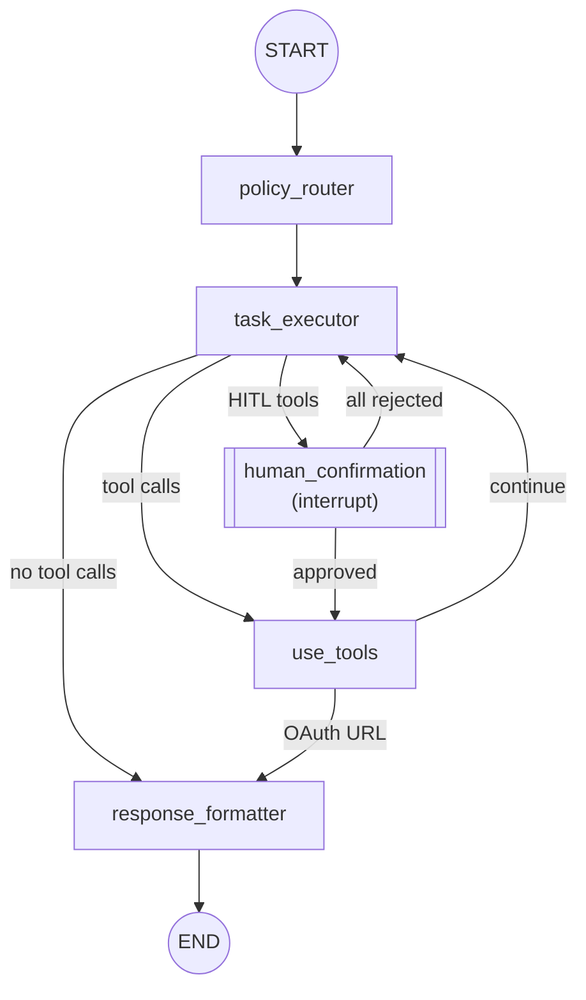

# MSG-Agent

A LangGraph-based agentic system that acts as an MCP client, consuming tools from assistant-mcp to fulfill user requests for calendar operations.

## Architecture



### Nodes

| Node | Purpose |
|------|---------|
| `policy_router` | Evaluates user request and determines which tool types (calendar, maps) are allowed |
| `task_executor` | Main agent loop - makes tool calls, handles clarifying questions |
| `use_tools` | Executes MCP tool calls via LangGraph ToolNode |
| `human_confirmation` | Human-in-the-loop node for tools requiring user approval |
| `response_formatter` | Produces final user-facing message |

### Conditional Edges

| Edge | From | Routes To | Condition |
|------|------|-----------|-----------|
| `route_from_task_executor` | task_executor | human_confirmation | If HITL tools detected |
| `route_from_task_executor` | task_executor | use_tools | If tool_calls present |
| `route_from_task_executor` | task_executor | response_formatter | If no tool_calls |
| `oauth_url_detection` | use_tools | response_formatter | If OAuth URL detected |
| `oauth_url_detection` | use_tools | task_executor | Otherwise (continue loop) |
| `route_from_human_confirmation` | human_confirmation | use_tools | If any tools approved |
| `route_from_human_confirmation` | human_confirmation | task_executor | If all rejected |

## Project Structure

```
msg-agent/
├── .env                       # Environment configuration
├── .gitignore
├── .python-version            # Python 3.13
├── pyproject.toml             # Dependencies and metadata
├── uv.lock                    # Dependency lock file
├── README.md
│
└── src/
    ├── main.py                # FastAPI entry point
    │
    ├── agentic/
    │   ├── state.py           # RequestState schema
    │   ├── graph.py           # LangGraph workflow definition
    │   ├── edges.py           # Conditional routing logic
    │   │
    │   ├── nodes/
    │   │   ├── agent.py       # policy_router, task_executor, response_formatter
    │   │   ├── tool.py        # use_tools node (MCP tool execution)
    │   │   └── human.py       # Human-in-the-loop nodes
    │   │
    │   └── schema/
    │       ├── prompts.py     # Agent system prompts
    │       └── models.py      # Pydantic models for structured outputs
    │
    ├── mcp_module/
    │   └── adapter.py         # MCP client setup, TOOL_MAPPING
    │
    └── utils/
        ├── helpers.py         # Utility functions
        └── models.py          # FastAPI request/response models
```

## Installation

```bash
# Clone the repository
git clone <repo-url>
cd msg-agent

# Install dependencies with uv
uv sync
```

## Configuration

Create a `.env` file with:

```env
ASSISTANT_MCP_URL=http://127.0.0.1:8000/mcp
GOOGLE_API_KEY=your-google-api-key
OPENAI_API_KEY=your-openai-api-key
```

| Variable | Description |
|----------|-------------|
| `ASSISTANT_MCP_URL` | URL to the assistant-mcp server (or any mcp server) |
| `GOOGLE_API_KEY` | API key for Gemini models (optional) |
| `OPENAI_API_KEY` | API key for OpenAI models (optional) |

## Running

```bash
uv run uvicorn src.main:app --port 8002
```

The server runs on `http://127.0.0.1:8002`.

## API

### POST /run

Execute a user request through the agent workflow.

**Request:**
```bash
curl -X POST http://127.0.0.1:8002/run \
  -H "Content-Type: application/json" \
  -d '{"thread_id": "any-string", "user_request": "show me what is on my calendar"}'
```

**Request Body:**

| Field | Type | Description |
|-------|------|-------------|
| `thread_id` | string | Identifier for the conversation thread |
| `user_request` | string | Natural language request |

**Response (success):**
```json
{
  "status": "success",
  "response": "Upcoming event on your primary calendar:\n\n- Test Event\n  - When: Friday, January 15, 2026 from 1:30 PM to 2:30 PM"
}
```

**Response (HITL confirmation required):**
```json
{
  "status": "confirmation_required",
  "thread_id": "any-string",
  "pending_action": {
    "kind": "confirmation",
    "tool_calls": [
      {
        "call_id": "call_abc123",
        "tool_name": "create_event",
        "arguments": {
          "calendar_id": "primary",
          "start": "2026-01-16T10:00:00",
          "name": "Team Meeting",
          "duration_minutes": 30
        }
      }
    ]
  }
}
```

### POST /resume

Resume a paused graph execution after human confirmation.

**Request:**
```bash
curl -X POST http://127.0.0.1:8002/resume \
  -H "Content-Type: application/json" \
  -d '{
    "thread_id": "any-string",
    "approvals": [
      {"call_id": "call_abc123", "approved": true}
    ]
  }'
```

**Request Body:**

| Field | Type | Description |
|-------|------|-------------|
| `thread_id` | string | Same thread_id from the /run response |
| `approvals` | array | List of approval decisions for each tool call |
| `approvals[].call_id` | string | The call_id from pending_action.tool_calls |
| `approvals[].approved` | boolean | Whether to approve this tool call |
| `approvals[].feedback` | string? | Optional feedback (required if rejected) |

**Response:**
```json
{
  "status": "success",
  "response": "Team Meeting has been created for January 16, 2026 at 10:00 AM."
}
```

### GET /health-check

Health check endpoint.

```bash
curl http://127.0.0.1:8002/health-check
```

## MCP Tool Mapping

Modify this to whatever MCP server you are connecting.

```python
TOOL_MAPPING = {
    'calendar': ["list_calendars", "list_events", "create_event", "update_event"]
}

# Tools requiring human-in-the-loop confirmation
HITL_TOOLS = {'create_event', 'update_event'}
```

## State Schema

```python
class RequestState(MessagesState):
    allowed_tool_types: list[str]              # From policy_router
    pending_action: NotRequired[PendingAction] # OAuth, form elicitation, or confirmation
    final_response: NotRequired[str]           # Final message to user
    approval_outcome: NotRequired[ApprovalOutcome]  # Result of HITL approval

class ToolCallInfo(TypedDict):
    call_id: str              # Unique ID from AIMessage.tool_calls[].id
    tool_name: str
    arguments: dict[str, Any]

class RejectedToolFeedback(TypedDict):
    call_id: str
    tool_name: str
    feedback: str

class ApprovalOutcome(TypedDict):
    all_approved: bool
    approved_call_ids: List[str]
    rejected_feedback: List[RejectedToolFeedback]

class PendingApproval(TypedDict):
    kind: Literal["confirmation"]
    tool_calls: List[ToolCallInfo]
```

### pending_action.kind Values
- `"oauth_url"` - OAuth URL elicitation flow
- `"form_elicitation"` - Form-based elicitation flow
- `"confirmation"` - Human-in-the-loop confirmation
- `"no_action_needed"` - Default

## Human-in-the-Loop (HITL) Flow

Tools in `HITL_TOOLS` (`create_event`, `update_event`) require user confirmation before execution.

### Flow Diagram

```
1. /run request
   ↓
2. task_executor detects HITL tools
   ↓
3. Sets pending_action.kind = "confirmation" with tool_calls
   ↓
4. Routes to human_confirmation node
   ↓
5. interrupt() pauses graph, returns 202 to client
   ↓
6. Client displays tool calls for user approval
   ↓
7. /resume with approvals
   ↓
8. human_confirmation processes approvals:
   - All approved → use_tools → execute → response_formatter
   - All rejected → task_executor (with feedback) → may retry
   - Partial → use_tools (approved only) → task_executor (feedback) → response_formatter
```

### Approval Scenarios

| Scenario | Behavior |
|----------|----------|
| **All approved** | Tools execute, returns success response |
| **All rejected** | Feedback sent to task_executor, agent may propose alternatives |
| **Partial** | Approved tools execute, rejected feedback sent to agent |

### Message Sequence (Partial Approval)

When some tools are approved and others rejected, the message sequence must satisfy the API requirement that every `tool_call` has a corresponding `ToolMessage`:

```
1. AIMessage with tool_calls [A, B, C]
2. ToolMessage for A (approved placeholder)
3. ToolMessage for B (rejected with feedback)
4. ToolMessage for C (rejected with feedback)
5. New AIMessage with tool_calls [A] only
6. ToolMessage for A (actual execution result)
```

## Testing Flows

Start the server:
```bash
uv run uvicorn src.main:app --port 8002
```

### Test 1: Direct Approval

```bash
# Step 1: Create event request
curl -X POST http://127.0.0.1:8002/run \
  -H "Content-Type: application/json" \
  -d '{"thread_id": "test-1", "user_request": "create a meeting called Standup tomorrow at 9am"}'

# Response: confirmation_required with call_id

# Step 2: Approve
curl -X POST http://127.0.0.1:8002/resume \
  -H "Content-Type: application/json" \
  -d '{"thread_id": "test-1", "approvals": [{"call_id": "<call_id>", "approved": true}]}'

# Response: success with event created
```

### Test 2: Rejection with Feedback

```bash
# Step 1: Create event request
curl -X POST http://127.0.0.1:8002/run \
  -H "Content-Type: application/json" \
  -d '{"thread_id": "test-2", "user_request": "create an event called Dentist tomorrow at 9am"}'

# Step 2: Reject with feedback
curl -X POST http://127.0.0.1:8002/resume \
  -H "Content-Type: application/json" \
  -d '{"thread_id": "test-2", "approvals": [{"call_id": "<call_id>", "approved": false, "feedback": "Wrong time, should be 10am"}]}'

# Response: confirmation_required with corrected time (10am)

# Step 3: Approve corrected event
curl -X POST http://127.0.0.1:8002/resume \
  -H "Content-Type: application/json" \
  -d '{"thread_id": "test-2", "approvals": [{"call_id": "<new_call_id>", "approved": true}]}'
```

### Test 3: Partial Approval

```bash
# Step 1: Create 2 events
curl -X POST http://127.0.0.1:8002/run \
  -H "Content-Type: application/json" \
  -d '{"thread_id": "test-3", "user_request": "create 2 events: Team Meeting at 10am and Lunch with Bob at 12pm"}'

# Response: confirmation_required with 2 tool_calls

# Step 2: Approve first, reject second
curl -X POST http://127.0.0.1:8002/resume \
  -H "Content-Type: application/json" \
  -d '{
    "thread_id": "test-3",
    "approvals": [
      {"call_id": "<call_id_1>", "approved": true},
      {"call_id": "<call_id_2>", "approved": false, "feedback": "I have other lunch plans"}
    ]
  }'

# Response: success - first event created, second acknowledged as rejected
```

## Related

- **assistant-mcp**: The MCP server providing calendar/maps tools
