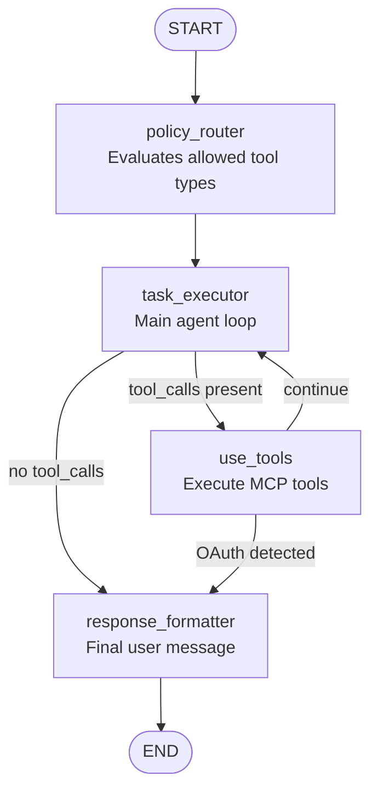

# MSG-Agent

A LangGraph-based agentic system that acts as an MCP client, consuming tools from assistant-mcp to fulfill user requests for calendar operations.

## Architecture



### Nodes

| Node | Purpose |
|------|---------|
| `policy_router` | Evaluates user request and determines which tool types (calendar, maps) are allowed |
| `task_executor` | Main agent loop - makes tool calls, handles clarifying questions |
| `use_tools` | Executes MCP tool calls via LangGraph ToolNode |
| `response_formatter` | Produces final user-facing message |

### Conditional Edges

| Edge | From | Routes To | Condition |
|------|------|-----------|-----------|
| `continue_to_tool` | task_executor | use_tools | If tool_calls present |
| `continue_to_tool` | task_executor | response_formatter | If no tool_calls |
| `oauth_url_detection` | use_tools | response_formatter | If OAuth elicitation detected |
| `oauth_url_detection` | use_tools | task_executor | Otherwise (continue loop) |

## Project Structure

```
msg-agent/
├── .env                       # Environment configuration
├── .gitignore
├── .python-version            # Python 3.13
├── pyproject.toml             # Dependencies and metadata
├── uv.lock                    # Dependency lock file
├── README.md
│
└── src/
    ├── main.py                # FastAPI entry point
    │
    ├── agentic/
    │   ├── state.py           # RequestState schema
    │   ├── graph.py           # LangGraph workflow definition
    │   ├── edges.py           # Conditional routing logic
    │   │
    │   ├── nodes/
    │   │   ├── agent.py       # policy_router, task_executor, response_formatter
    │   │   ├── tool.py        # use_tools node (MCP tool execution)
    │   │   └── human.py       # Human-in-the-loop nodes
    │   │
    │   └── schema/
    │       ├── prompts.py     # Agent system prompts
    │       └── models.py      # Pydantic models for structured outputs
    │
    ├── mcp_module/
    │   └── adapter.py         # MCP client setup, TOOL_MAPPING
    │
    └── utils/
        ├── helpers.py         # Utility functions
        └── models.py          # FastAPI request/response models
```

## Installation

```bash
# Clone the repository
git clone <repo-url>
cd msg-agent

# Install dependencies with uv
uv sync
```

## Configuration

Create a `.env` file with:

```env
ASSISTANT_MCP_URL=http://127.0.0.1:8000/mcp
GOOGLE_API_KEY=your-google-api-key
OPENAI_API_KEY=your-openai-api-key
```

| Variable | Description |
|----------|-------------|
| `ASSISTANT_MCP_URL` | URL to the assistant-mcp server (or any mcp server) |
| `GOOGLE_API_KEY` | API key for Gemini models (optional) |
| `OPENAI_API_KEY` | API key for OpenAI models (optional) |

## Running

```bash
uv run uvicorn src.main:app --port 8002
```

The server runs on `http://127.0.0.1:8002`.

## API (Work in Progress)

### POST /run

Execute a user request through the agent workflow.

**Request:**
```bash
curl -X POST http://127.0.0.1:8002/run \
  -H "Content-Type: application/json" \
  -d '{"thread_id": "any-string", "user_request": "show me what is on my calendar"}'
```

**Request Body:**

| Field | Type | Description |
|-------|------|-------------|
| `thread_id` | string | Identifier for the conversation thread |
| `user_request` | string | Natural language request |

**Response:**
```json
{
  "status": "success",
  "response": "Upcoming event on your primary calendar:\n\n- Test Event\n  - When: Friday, January 15, 2026 from 1:30 PM to 2:30 PM"
}
```

### GET /health-check

Health check endpoint.

```bash
curl http://127.0.0.1:8002/health-check
```

## MCP Tool Mapping

Modify this to whatever MCP server you are connecting.

```python
TOOL_MAPPING = {
    'calendar': ["list_calendars", "list_events", "create_event", "update_event"]
}
```

## State Schema

```python
class RequestState(MessagesState):
    allowed_tool_types: list[str]         # From policy_router
    pending_action: NotRequired[...]      # OAuth, form elicitation, or confirmation
    final_response: NotRequired[str]      # Final message to user
```

### pending_action.kind Values
- `"oauth_url"` - OAuth URL elicitation flow
- `"form_elicitation"` - Form-based elicitation flow
- `"confirmation"` - Human-in-the-loop confirmation
- `"no_action_needed"` - Default

## Related

- **assistant-mcp**: The MCP server providing calendar/maps tools
